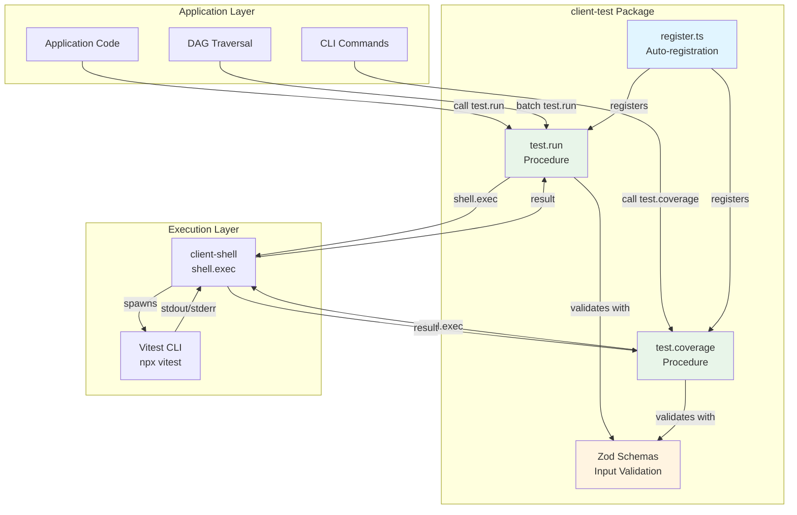
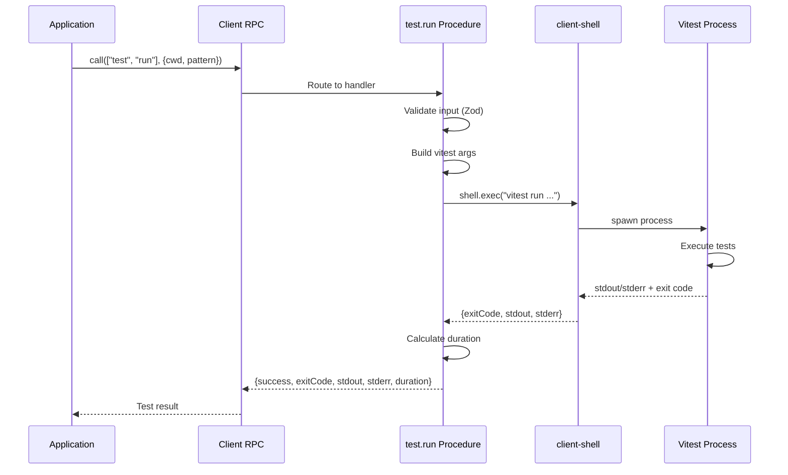
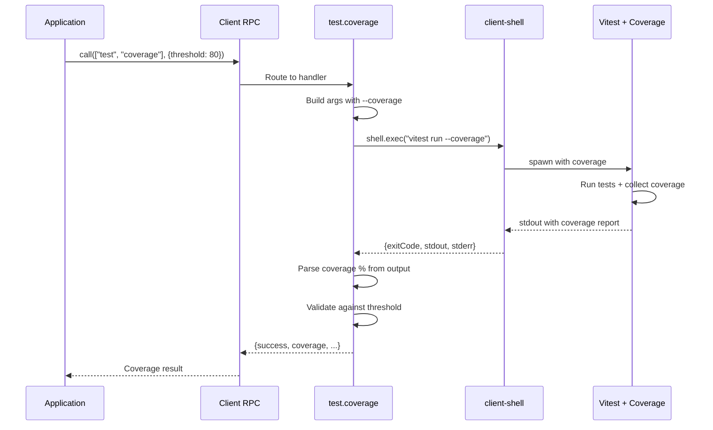

# @mark1russell7/client-test

[](https://www.npmjs.com/package/@mark1russell7/client-test)
[](https://opensource.org/licenses/MIT)

Test execution procedures for the ecosystem - run tests and collect coverage via client procedures.

## Overview

`client-test` provides client procedures for running tests across the ecosystem. It wraps test runners (primarily Vitest) and exposes them as callable procedures, enabling test execution as part of automated workflows, DAG traversals, and CLI commands.

### Key Features

- **Test Execution**: Run tests via `client.call(["test", "run"], {...})`
- **Coverage Reporting**: Collect and validate coverage metrics
- **Watch Mode**: Interactive test watching during development
- **Pattern Matching**: Run specific test files or suites
- **Threshold Validation**: Enforce minimum coverage requirements
- **Integration Ready**: Works with DAG traversal for multi-package testing

## Installation

```bash
npm install @mark1russell7/client-test
```

### Dependencies

- `@mark1russell7/client` - Client RPC system
- `@mark1russell7/client-shell` - Shell command execution
- `zod` - Schema validation

## Architecture



### Test Execution Flow



### Coverage Flow



## Quick Start

```typescript
import { Client } from "@mark1russell7/client";
import "@mark1russell7/client-test/register";

const client = new Client({ /* transport */ });

// Run all tests
const result = await client.call(["test", "run"], {
  cwd: "/path/to/project",
});

// Run specific tests
await client.call(["test", "run"], {
  pattern: "**/*.unit.test.ts",
  timeout: 30000,
});

// Run with coverage
const coverage = await client.call(["test", "coverage"], {
  threshold: 80,
});
```

## Procedures

| Path | Description |
|------|-------------|
| `test.run` | Run tests |
| `test.coverage` | Run tests with coverage |

### test.run

Run tests with configurable options.

```typescript
interface TestRunInput {
  cwd?: string;          // Working directory
  pattern?: string;      // Test file pattern
  watch?: boolean;       // Watch mode (default: false)
  coverage?: boolean;    // Enable coverage (default: false)
  reporter?: string;     // Reporter to use
  timeout?: number;      // Test timeout in ms
}

interface TestRunOutput {
  success: boolean;      // All tests passed
  exitCode: number;      // Exit code from runner
  stdout: string;        // Test output
  stderr: string;        // Error output
  duration: number;      // Total duration in ms
}
```

**Example:**
```typescript
// Run all tests
const result = await client.call(["test", "run"], {
  cwd: "/my/project",
});

if (!result.success) {
  console.error("Tests failed:", result.stderr);
}

// Watch mode
await client.call(["test", "run"], {
  watch: true,
  pattern: "src/**/*.test.ts",
});
```

### test.coverage

Run tests with coverage reporting.

```typescript
interface TestCoverageInput {
  cwd?: string;          // Working directory
  pattern?: string;      // Test file pattern
  threshold?: number;    // Coverage threshold (0-100)
}

interface TestCoverageOutput {
  success: boolean;
  exitCode: number;
  stdout: string;
  stderr: string;
  duration: number;
  coverage?: number;     // Coverage percentage
}
```

**Example:**
```typescript
// Run with 80% threshold
const result = await client.call(["test", "coverage"], {
  cwd: "/my/project",
  threshold: 80,
});

if (result.coverage !== undefined) {
  console.log(`Coverage: ${result.coverage}%`);
}
```

## CLI Usage

```bash
# Run tests via mark CLI
mark test run

# Run with pattern
mark test run --pattern "**/*.unit.test.ts"

# Run with coverage
mark test coverage --threshold 80
```

## Package Ecosystem

```
┌─────────────────────────────────────────────────────────────────────────────┐
│                              client                                          │
│                         (Core RPC framework)                                 │
└───────────────────────────────────┬─────────────────────────────────────────┘
                                    │
                                    ▼
┌─────────────────────────────────────────────────────────────────────────────┐
│                           client-test                                        │
│                    (Test execution procedures)                               │
└───────────────────────────────────┬─────────────────────────────────────────┘
                                    │
                                    ▼
┌─────────────────────────────────────────────────────────────────────────────┐
│                          client-shell                                        │
│                    (Shell command execution)                                 │
└───────────────────────────────────┬─────────────────────────────────────────┘
                                    │
                                    ▼
                          ┌─────────────────────┐
                          │   vitest / jest     │
                          │   (Test runners)    │
                          └─────────────────────┘
```

## License

MIT
