# @mark1russell7/client-test

[](https://www.npmjs.com/package/@mark1russell7/client-test)
[](https://opensource.org/licenses/MIT)

Test execution procedures for the ecosystem - run tests and collect coverage via client procedures.

## Overview

`client-test` provides client procedures for running tests across the ecosystem. It wraps test runners (primarily Vitest) and exposes them as callable procedures, enabling test execution as part of automated workflows, DAG traversals, and CLI commands.

### Key Features

- **Test Execution**: Run tests via `client.call(["test", "run"], {...})`
- **Coverage Reporting**: Collect and validate coverage metrics
- **Watch Mode**: Interactive test watching during development
- **Pattern Matching**: Run specific test files or suites
- **Threshold Validation**: Enforce minimum coverage requirements
- **Integration Ready**: Works with DAG traversal for multi-package testing
- **Zod Validation**: Robust input schema validation

## Installation

```bash
npm install @mark1russell7/client-test
```

### Dependencies

- `@mark1russell7/client` - Client RPC system
- `@mark1russell7/client-shell` - Shell command execution
- `zod` - Schema validation

## Architecture


### Test Execution Flow


### Coverage Flow

```mermaid
sequenceDiagram
    participant App as Application
    participant Client as Client RPC
    participant Coverage as test.coverage
    participant Shell as client-shell
    participant Vitest as Vitest + Coverage

    App->>Client: call(["test", "coverage"], {threshold: 80})
    Client->>Coverage: Route to handler
    Coverage->>Coverage: Build args with --coverage
    Coverage->>Shell: shell.exec("vitest run --coverage")
    Shell->>Vitest: spawn with coverage
    Vitest->>Vitest: Run tests + collect coverage
    Vitest-->>Shell: stdout with coverage report
    Shell-->>Coverage: {exitCode, stdout, stderr}
    Coverage->>Coverage: Parse coverage % from output
    Coverage->>Coverage: Validate against threshold
    Coverage-->>Client: {success, coverage, ...}
    Client-->>App: Coverage result
```



## Usage

### Basic Test Execution

```typescript
import { Client } from "@mark1russell7/client";

const client = new Client();

// Run all tests in a package
const result = await client.call(["test", "run"], {
  cwd: "/path/to/package"
});

if (result.success) {
  console.log("All tests passed!");
} else {
  console.error("Tests failed with exit code:", result.exitCode);
  console.error(result.stderr);
}
```

### Pattern Matching

```typescript
// Run only unit tests
await client.call(["test", "run"], {
  cwd: "/path/to/package",
  pattern: "**/*.unit.test.ts"
});

// Run integration tests
await client.call(["test", "run"], {
  pattern: "tests/integration/**/*.test.ts"
});
```

### Watch Mode

```typescript
// Start watch mode for development
await client.call(["test", "run"], {
  cwd: "/path/to/package",
  watch: true,
  pattern: "src/**/*.test.ts"
});
```

### Coverage with Thresholds

```typescript
// Enforce 80% coverage
const coverageResult = await client.call(["test", "coverage"], {
  cwd: "/path/to/package",
  threshold: 80
});

if (!coverageResult.success) {
  if (coverageResult.coverage !== undefined) {
    console.error(`Coverage ${coverageResult.coverage}% below threshold`);
  }
}
```

### Integration with DAG Traversal

```typescript
// Test all packages in dependency order
import { buildLeveledDAG, executeDAG, createProcessor } from "@mark1russell7/client-dag";

const processor = createProcessor(async (node) => {
  const result = await client.call(["test", "run"], {
    cwd: node.data.path
  });

  if (!result.success) {
    throw new Error(`Tests failed for ${node.id}`);
  }
});

await executeDAG(dag, processor, { concurrency: 4 });
```

## API Reference

### Procedures

#### `test.run`

Run tests with configurable options.

**Path:** `["test", "run"]`

**Input:**
```typescript
{
  cwd?: string;          // Working directory (default: process.cwd())
  pattern?: string;      // Test file pattern (e.g., "**/*.test.ts")
  watch?: boolean;       // Enable watch mode (default: false)
  coverage?: boolean;    // Enable coverage (default: false)
  reporter?: string;     // Reporter to use (e.g., "verbose", "json")
  timeout?: number;      // Test timeout in milliseconds
}
```

**Output:**
```typescript
{
  success: boolean;      // true if all tests passed (exitCode === 0)
  exitCode: number;      // Exit code from vitest process
  stdout: string;        // Standard output from test runner
  stderr: string;        // Standard error from test runner
  duration: number;      // Total execution time in milliseconds
}
```

**CLI Shortcuts:**
- `-C` / `--cwd` - Working directory
- `-w` / `--watch` - Watch mode
- `-c` / `--coverage` - Enable coverage
- `-p` / `--pattern` - Test pattern

#### `test.coverage`

Run tests with coverage reporting and threshold validation.

**Path:** `["test", "coverage"]`

**Input:**
```typescript
{
  cwd?: string;          // Working directory
  pattern?: string;      // Test file pattern
  threshold?: number;    // Minimum coverage percentage (0-100)
}
```

**Output:**
```typescript
{
  success: boolean;      // true if tests pass AND coverage >= threshold
  exitCode: number;      // Exit code from vitest
  stdout: string;        // Test output with coverage report
  stderr: string;        // Error output
  duration: number;      // Execution time in ms
  coverage?: number;     // Parsed coverage percentage (if available)
}
```

**CLI Shortcuts:**
- `-C` / `--cwd` - Working directory
- `-p` / `--pattern` - Test pattern
- `-t` / `--threshold` - Coverage threshold

### Types

All types are exported from the main module:

```typescript
import type {
  TestRunInput,
  TestRunOutput,
  TestCoverageInput,
  TestCoverageOutput,
} from "@mark1russell7/client-test";
```

#### `TestRunInput`

```typescript
interface TestRunInput {
  cwd?: string;
  pattern?: string;
  watch?: boolean;        // default: false
  coverage?: boolean;     // default: false
  reporter?: string;
  timeout?: number;
}
```

#### `TestRunOutput`

```typescript
interface TestRunOutput {
  success: boolean;
  exitCode: number;
  stdout: string;
  stderr: string;
  duration: number;
}
```

#### `TestCoverageInput`

```typescript
interface TestCoverageInput {
  cwd?: string;
  pattern?: string;
  threshold?: number;
}
```

#### `TestCoverageOutput`

```typescript
interface TestCoverageOutput {
  success: boolean;
  exitCode: number;
  stdout: string;
  stderr: string;
  duration: number;
  coverage?: number | undefined;
}
```

### Schemas

Zod schemas are exported for runtime validation:

```typescript
import { TestRunInputSchema, TestCoverageInputSchema } from "@mark1russell7/client-test";

// Validate input manually
const validated = TestRunInputSchema.parse({
  cwd: "/path/to/package",
  watch: true
});
```

## Examples

### Example 1: CI/CD Integration

```typescript
// Run tests with strict coverage requirements
const testAll = async () => {
  const packages = await getMonorepoPackages();

  for (const pkg of packages) {
    const result = await client.call(["test", "coverage"], {
      cwd: pkg.path,
      threshold: 80
    });

    if (!result.success) {
      console.error(`Failed: ${pkg.name}`);
      console.error(`Coverage: ${result.coverage}%`);
      process.exit(1);
    }
  }

  console.log("All packages passed with >80% coverage");
};
```

### Example 2: Selective Testing

```typescript
// Run only changed tests
const changedFiles = await getGitChangedFiles();
const testPatterns = changedFiles
  .filter(f => f.endsWith('.ts'))
  .map(f => f.replace(/\.ts$/, '.test.ts'));

for (const pattern of testPatterns) {
  await client.call(["test", "run"], { pattern });
}
```

### Example 3: Parallel Test Execution

```typescript
// Test multiple packages in parallel
const results = await Promise.all(
  packages.map(pkg =>
    client.call(["test", "run"], {
      cwd: pkg.path,
      reporter: "json"
    })
  )
);

const failed = results.filter(r => !r.success);
if (failed.length > 0) {
  console.error(`${failed.length} packages failed tests`);
}
```

### Example 4: Custom Reporter

```typescript
// Use specific reporter
await client.call(["test", "run"], {
  cwd: "/path/to/package",
  reporter: "verbose"  // or "json", "junit", etc.
});
```

### Example 5: Timeout Configuration

```typescript
// Set custom timeout for slow tests
await client.call(["test", "run"], {
  cwd: "/path/to/integration-tests",
  timeout: 60000,  // 60 seconds
  pattern: "**/*.integration.test.ts"
});
```

## Integration with Ecosystem

### Dependency Graph


### Used By

- **Bundle Packages**: Aggregate test procedures
- **CLI**: Expose test commands
- **DAG Traversal**: Batch test multiple packages
- **CI/CD Pipelines**: Automated testing workflows

### Works With

- **client-vitest**: Alternative direct vitest integration
- **client-dag**: Multi-package test orchestration
- **client-lib**: Package dependency resolution

## Configuration

### Auto-Registration

Procedures register automatically on import:

```json
{
  "client": {
    "procedures": "./dist/register.js"
  }
}
```

### Vitest Configuration

The package executes `vitest` via `client-shell`, which means it respects your project's `vitest.config.ts`:

```typescript
// vitest.config.ts
export default {
  test: {
    coverage: {
      provider: 'v8',
      reporter: ['text', 'json', 'html']
    }
  }
};
```

## Package Structure

```
client-test/
├── src/
│   ├── index.ts              # Main exports
│   ├── types.ts              # Zod schemas & TypeScript types
│   ├── register.ts           # Procedure registration
│   └── procedures/
│       └── test/
│           ├── index.ts      # Procedure exports
│           ├── run.ts        # test.run implementation
│           └── coverage.ts   # test.coverage implementation
├── dist/                     # Compiled output
├── package.json
├── tsconfig.json
└── README.md
```

## Development

### Build

```bash
npm run build
```

### Type Check

```bash
npm run typecheck
```

### Clean

```bash
npm run clean
```

## CLI Usage

If using with the mark CLI:

```bash
# Run tests
mark test run --cwd /path/to/package

# Run with pattern
mark test run --pattern "**/*.unit.test.ts"

# Run with coverage
mark test coverage --threshold 80

# Watch mode
mark test run --watch
```

## Troubleshooting

### Tests not running

Ensure vitest is installed in your project:

```bash
npm install --save-dev vitest
```

### Coverage not collected

Install coverage provider:

```bash
npm install --save-dev @vitest/coverage-v8
```

### Timeout errors

Increase timeout for slow tests:

```typescript
await client.call(["test", "run"], {
  timeout: 120000  // 2 minutes
});
```

## License

MIT - Mark Russell

## Related Packages

- `@mark1russell7/client` - Client RPC system
- `@mark1russell7/client-shell` - Shell execution
- `@mark1russell7/client-vitest` - Direct vitest integration
- `@mark1russell7/client-dag` - DAG execution for batch testing
